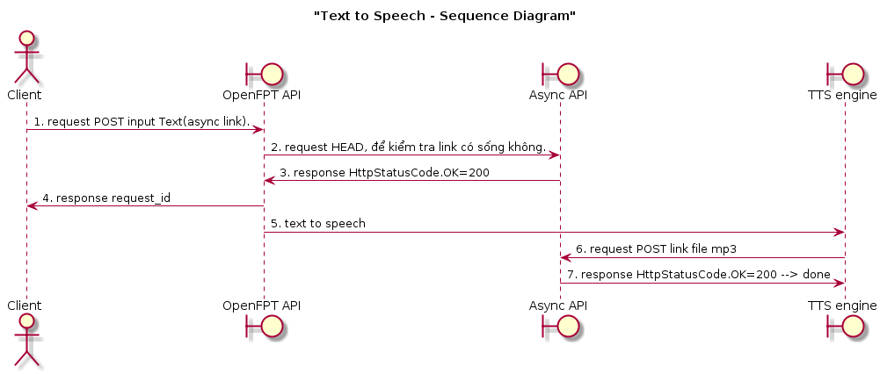

# Vietnamese Speech Synthesis RESTful simple for .NET

## Giới thiệu
Một project đơn giản hướng dẫn các comunication với TTS của OpenFpt thông qua phương thức bất đông bộ

## Cấu trúc

[](processtts.png?raw=true)

### Project OpenFpt.TTS

là một thư viện hỗ trợ object làm việc với text2speech service

cách dùng thư viện
```java
	string token = "token của bạn";
	// async là link đến dịch vụ đón kết quả của người dùng
	// nếu async là rỗng, hệ thống sẽ trả về link trực tiếp đên file mp3, nhưng file này có thể chưa tồn 
	// tại ở thời điểm response do hệ thống còn đang xử lý chuyển text sang âm thanh. nếu async khác rỗng, 
	// hệ thống sẽ gửi request thông tin kết quả đến link đó sau đã xử lý xong
	string asyncLink = null;
	Text2Speech tts = new Text2Speech(token,asyncLink);
	AsyncResponseData responseData = tts.Speech("xin chào bạn");
	// nhận một object chứa link của file Mp3.
	Console.Writeline(responseData.audio_menv_url);
```
### Project AsyncTtsService

là một Web Service để đón kết quả trả về từ text2speech service.

cài đặt lên IIS theo link: http://krismanohar.com/blog/?p=34